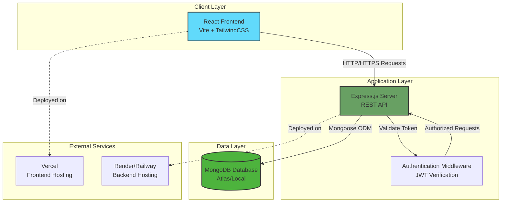
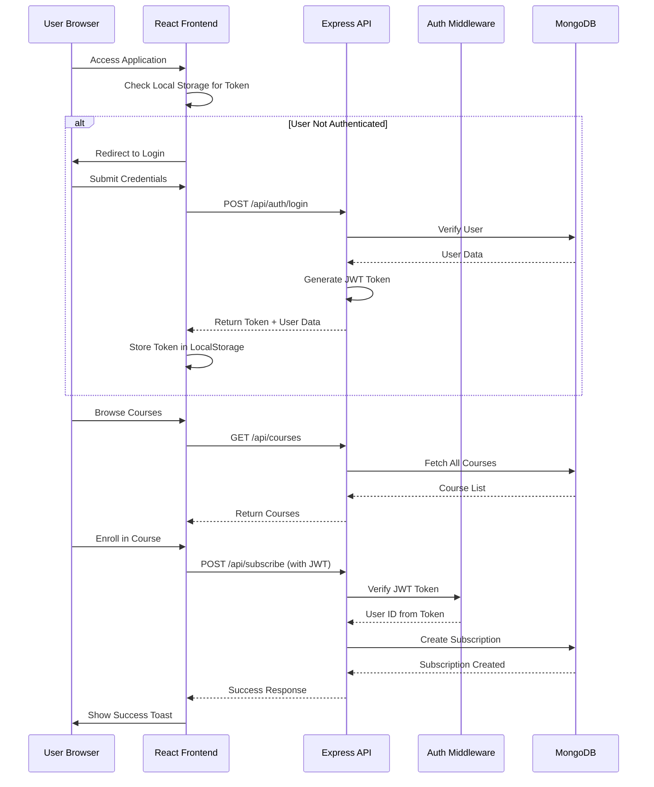
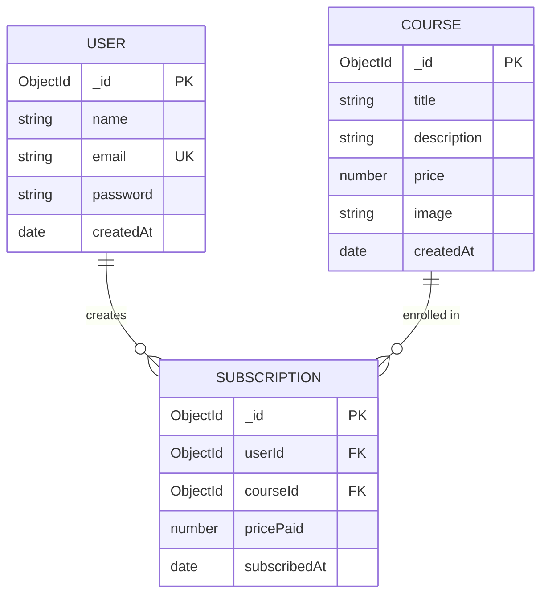
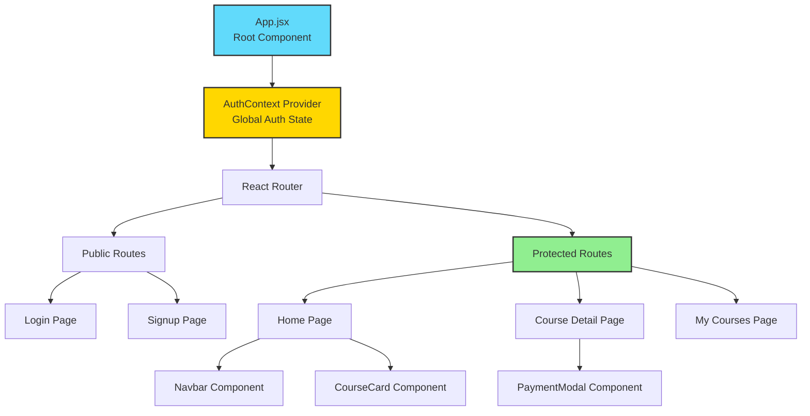
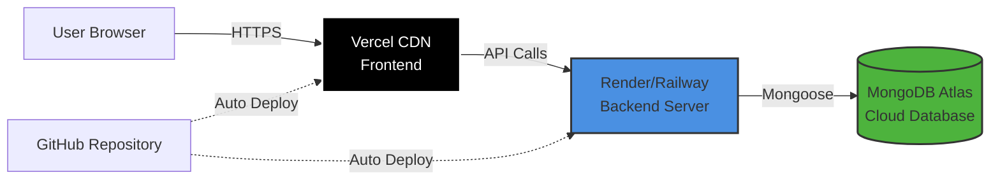

# 🏗️ CourseHub - System Architecture & Technical Documentation

## Table of Contents
1. [Project Overview](#project-overview)
2. [System Architecture](#system-architecture)
3. [Technology Stack](#technology-stack)
4. [Database Design](#database-design)
5. [API Architecture](#api-architecture)
6. [Frontend Architecture](#frontend-architecture)
7. [Security Implementation](#security-implementation)
8. [Deployment Architecture](#deployment-architecture)
9. [Design Decisions & Rationale](#design-decisions--rationale)

---

## Project Overview

**CourseHub** is a full-stack course subscription platform with a Black Friday promotional theme. The application allows users to:
- Browse and enroll in **8 free courses** instantly
- Purchase **5 premium courses** with a 50% discount using promo code `BFSALE25`
- Manage their course subscriptions through a personalized dashboard
- Experience a modern, responsive UI with dark mode aesthetics

### Key Metrics
- **Total Courses**: 13 (8 free + 5 premium)
- **Discount**: 50% off with promo code
- **Authentication**: JWT-based secure authentication
- **Database**: MongoDB with Mongoose ODM

---

## System Architecture

### High-Level Architecture



### Request Flow



---

## Technology Stack

### Backend Technologies

| Technology | Version | Purpose | Why We Chose It |
|------------|---------|---------|-----------------|
| **Node.js** | v16+ | Runtime Environment | Non-blocking I/O, excellent for real-time applications, large ecosystem |
| **Express.js** | ^4.18.2 | Web Framework | Minimalist, flexible, industry standard for Node.js APIs |
| **MongoDB** | Latest | NoSQL Database | Flexible schema, JSON-like documents, excellent for rapid development |
| **Mongoose** | ^8.0.3 | ODM (Object Data Modeling) | Schema validation, middleware support, query building |
| **JWT** | ^9.0.2 | Authentication | Stateless authentication, scalable, secure token-based auth |
| **bcryptjs** | ^2.4.3 | Password Hashing | Industry-standard encryption, salt rounds for security |
| **CORS** | ^2.8.5 | Cross-Origin Resource Sharing | Enable frontend-backend communication across domains |
| **dotenv** | ^16.3.1 | Environment Variables | Secure configuration management, separate dev/prod configs |

### Frontend Technologies

| Technology | Version | Purpose | Why We Chose It |
|------------|---------|---------|-----------------|
| **React** | ^19.2.0 | UI Library | Component-based architecture, virtual DOM, large community |
| **Vite** | ^7.2.4 | Build Tool | Lightning-fast HMR, optimized builds, modern ES modules |
| **React Router** | ^7.13.0 | Client-Side Routing | SPA navigation, protected routes, dynamic routing |
| **TailwindCSS** | ^3.4.19 | CSS Framework | Utility-first, rapid UI development, consistent design system |
| **Axios** | ^1.13.4 | HTTP Client | Promise-based, interceptors for auth, better error handling |
| **React Hot Toast** | ^2.6.0 | Notifications | Beautiful toast notifications, customizable, lightweight |

### Development Tools

| Tool | Purpose |
|------|---------|
| **Nodemon** | Auto-restart server on file changes during development |
| **ESLint** | Code quality and consistency enforcement |
| **Autoprefixer** | Automatic CSS vendor prefixing |

---

## Database Design

### Entity Relationship Diagram



### Data Models

#### 1. User Model
**File**: [`backend/models/User.js`](file:///home/wasim/Documents/github/Course-Subscription-Application/backend/models/User.js)

```javascript
{
  name: String,           // User's full name (optional, trimmed)
  email: String,          // Unique, lowercase, required
  password: String,       // Hashed with bcrypt (min 6 chars)
  createdAt: Date        // Auto-generated timestamp
}
```

**Design Decisions**:
- ✅ Email as unique identifier for login
- ✅ Password minimum length enforced at schema level
- ✅ Automatic timestamp for audit trail
- ✅ Email normalized to lowercase to prevent duplicates

#### 2. Course Model
**File**: [`backend/models/Course.js`](file:///home/wasim/Documents/github/Course-Subscription-Application/backend/models/Course.js)

```javascript
{
  title: String,          // Course name (required, trimmed)
  description: String,    // Course details (required)
  price: Number,          // 0 for free courses, >0 for paid
  image: String,          // Course thumbnail URL
  createdAt: Date        // Auto-generated timestamp
}
```

**Design Decisions**:
- ✅ Price of 0 indicates free course (simple boolean logic)
- ✅ Image URLs stored as strings (can be CDN links or base64)
- ✅ Validation at schema level (required fields, min price)

#### 3. Subscription Model
**File**: [`backend/models/Subscription.js`](file:///home/wasim/Documents/github/Course-Subscription-Application/backend/models/Subscription.js)

```javascript
{
  userId: ObjectId,       // Reference to User
  courseId: ObjectId,     // Reference to Course
  pricePaid: Number,      // Actual price paid (after discount)
  subscribedAt: Date     // Enrollment timestamp
}
```

**Design Decisions**:
- ✅ **Compound Index**: `{ userId: 1, courseId: 1 }` prevents duplicate enrollments
- ✅ `pricePaid` tracks actual amount paid (important for discount tracking)
- ✅ References to User and Course enable population/joins
- ✅ Subscription timestamp for analytics and sorting

---

## API Architecture

### RESTful API Design

#### Authentication Routes
**File**: [`backend/routes/authRoutes.js`](file:///home/wasim/Documents/github/Course-Subscription-Application/backend/routes/authRoutes.js)

| Endpoint | Method | Auth Required | Purpose |
|----------|--------|---------------|---------|
| `/api/auth/signup` | POST | ❌ | Register new user |
| `/api/auth/login` | POST | ❌ | Authenticate user, return JWT |

**Request/Response Examples**:

```javascript
// POST /api/auth/signup
Request: {
  "name": "John Doe",
  "email": "john@example.com",
  "password": "password123"
}

Response: {
  "success": true,
  "token": "eyJhbGciOiJIUzI1NiIsInR5cCI6IkpXVCJ9...",
  "user": {
    "_id": "507f1f77bcf86cd799439011",
    "name": "John Doe",
    "email": "john@example.com"
  }
}
```

#### Course Routes
**File**: [`backend/routes/courseRoutes.js`](file:///home/wasim/Documents/github/Course-Subscription-Application/backend/routes/courseRoutes.js)

| Endpoint | Method | Auth Required | Purpose |
|----------|--------|---------------|---------|
| `/api/courses` | GET | ❌ | Get all courses (public) |
| `/api/courses/:id` | GET | ❌ | Get single course details |

#### Subscription Routes
**File**: [`backend/routes/subscriptionRoutes.js`](file:///home/wasim/Documents/github/Course-Subscription-Application/backend/routes/subscriptionRoutes.js)

| Endpoint | Method | Auth Required | Purpose |
|----------|--------|---------------|---------|
| `/api/subscribe` | POST | ✅ | Enroll in a course |
| `/api/my-courses` | GET | ✅ | Get user's enrolled courses |

**Subscription Flow**:

```javascript
// POST /api/subscribe
Request Headers: {
  "Authorization": "Bearer <JWT_TOKEN>"
}

Request Body: {
  "courseId": "507f1f77bcf86cd799439011",
  "promoCode": "BFSALE25"  // Optional, for paid courses
}

Response: {
  "success": true,
  "message": "Successfully subscribed to course",
  "subscription": {
    "_id": "...",
    "userId": "...",
    "courseId": "...",
    "pricePaid": 2500,  // 50% of 5000
    "subscribedAt": "2026-02-04T15:30:00.000Z"
  }
}
```

#### Payment Routes
**File**: [`backend/routes/paymentRoutes.js`](file:///home/wasim/Documents/github/Course-Subscription-Application/backend/routes/paymentRoutes.js)

| Endpoint | Method | Auth Required | Purpose |
|----------|--------|---------------|---------|
| `/api/payment/validate-promo` | POST | ✅ | Validate promo code |

---

## Frontend Architecture

### Component Hierarchy



### Key Components

#### 1. Authentication Context
**File**: [`frontend/src/context/AuthContext.jsx`](file:///home/wasim/Documents/github/Course-Subscription-Application/frontend/src/context/AuthContext.jsx)

**Purpose**: Centralized authentication state management

**Features**:
- ✅ Global user state accessible to all components
- ✅ Persistent authentication (localStorage)
- ✅ Login/Logout functions
- ✅ Automatic token management

**Why Context API?**
- Avoids prop drilling through multiple component levels
- Simpler than Redux for small-to-medium apps
- Built into React (no additional dependencies)

#### 2. Protected Route Component
**File**: [`frontend/src/components/ProtectedRoute.jsx`](file:///home/wasim/Documents/github/Course-Subscription-Application/frontend/src/components/ProtectedRoute.jsx)

**Purpose**: Route guard for authenticated pages

**Logic**:
```javascript
if (!user) {
  return <Navigate to="/login" />
}
return <Outlet />  // Render child routes
```

#### 3. Course Card Component
**File**: [`frontend/src/components/CourseCard.jsx`](file:///home/wasim/Documents/github/Course-Subscription-Application/frontend/src/components/CourseCard.jsx)

**Features**:
- Displays course thumbnail, title, description, price
- **Free courses**: "Enroll Now" button (instant enrollment)
- **Paid courses**: "View Details" button (navigate to payment page)
- Responsive design with hover effects

#### 4. Payment Modal Component
**File**: [`frontend/src/components/PaymentModal.jsx`](file:///home/wasim/Documents/github/Course-Subscription-Application/frontend/src/components/PaymentModal.jsx)

**Features**:
- Promo code input and validation
- Real-time price calculation (original vs. discounted)
- Demo payment processing
- Success/Error toast notifications

### State Management Strategy

| State Type | Management Approach | Example |
|------------|---------------------|---------|
| **Global Auth State** | Context API | User login status, user data |
| **Component State** | useState Hook | Form inputs, modal visibility |
| **Server State** | Axios + useEffect | Course list, user subscriptions |
| **Form State** | Controlled Components | Login/Signup forms |

### Routing Structure

```javascript
<Routes>
  {/* Public Routes */}
  <Route path="/login" element={<Login />} />
  <Route path="/signup" element={<Signup />} />
  
  {/* Protected Routes */}
  <Route element={<ProtectedRoute />}>
    <Route path="/" element={<Home />} />
    <Route path="/course/:id" element={<CourseDetail />} />
    <Route path="/my-courses" element={<MyCourses />} />
  </Route>
</Routes>
```

---

## Security Implementation

### 1. Password Security

**Hashing Algorithm**: bcrypt with salt rounds

```javascript
// Registration
const hashedPassword = await bcrypt.hash(password, 10);

// Login Verification
const isMatch = await bcrypt.compare(password, user.password);
```

**Why bcrypt?**
- ✅ Adaptive hashing (adjustable cost factor)
- ✅ Built-in salt generation
- ✅ Resistant to rainbow table attacks
- ✅ Industry standard for password hashing

### 2. JWT Authentication

**Token Structure**:
```javascript
{
  payload: {
    userId: "507f1f77bcf86cd799439011"
  },
  secret: process.env.JWT_SECRET,
  expiresIn: "7d"  // 7-day expiration
}
```

**Authentication Middleware**:
**File**: [`backend/middleware/authMiddleware.js`](file:///home/wasim/Documents/github/Course-Subscription-Application/backend/middleware/authMiddleware.js)

```javascript
// Verify token from Authorization header
const token = req.headers.authorization?.split(' ')[1];
const decoded = jwt.verify(token, process.env.JWT_SECRET);
req.userId = decoded.userId;  // Attach to request
```

**Why JWT?**
- ✅ Stateless (no server-side session storage)
- ✅ Scalable across multiple servers
- ✅ Self-contained (includes user ID)
- ✅ Can be verified without database lookup

### 3. CORS Configuration

```javascript
app.use(cors());  // Allow all origins in development
```

**Production Recommendation**:
```javascript
app.use(cors({
  origin: process.env.FRONTEND_URL,
  credentials: true
}));
```

### 4. Input Validation

**Schema-Level Validation** (Mongoose):
- Required fields enforced
- Email format validation
- Password minimum length
- Price minimum value (>= 0)

**Application-Level Validation**:
- Duplicate subscription prevention (compound index)
- Promo code validation
- User existence checks

### 5. Environment Variables

**Sensitive Data Protection**:
```bash
MONGODB_URI=mongodb+srv://...  # Database credentials
JWT_SECRET=...                  # Token signing key
NODE_ENV=production             # Environment flag
```

**Security Measures**:
- ✅ `.env` files in `.gitignore`
- ✅ `.env.example` with placeholder values
- ✅ Separate configs for dev/staging/production

---

## Deployment Architecture

### Production Deployment Diagram



### Frontend Deployment (Vercel)

**Configuration**: [`vercel.json`](file:///home/wasim/Documents/github/Course-Subscription-Application/vercel.json)

```json
{
  "buildCommand": "cd frontend && npm run build",
  "outputDirectory": "frontend/dist",
  "rewrites": [
    { "source": "/(.*)", "destination": "/index.html" }
  ]
}
```

**Environment Variables**:
```bash
VITE_API_URL=https://your-backend.onrender.com/api
```

**Why Vercel?**
- ✅ Automatic HTTPS
- ✅ Global CDN for fast delivery
- ✅ Git integration (auto-deploy on push)
- ✅ Excellent for React/Vite apps
- ✅ Free tier for personal projects

### Backend Deployment (Render/Railway)

**Build Command**: `cd backend && npm install`  
**Start Command**: `cd backend && npm start`

**Environment Variables**:
```bash
MONGODB_URI=mongodb+srv://...
JWT_SECRET=...
NODE_ENV=production
PORT=5000
```

**Why Render/Railway?**
- ✅ Free tier with persistent storage
- ✅ Automatic SSL certificates
- ✅ Git-based deployments
- ✅ Easy environment variable management
- ✅ Built-in logging and monitoring

### Database (MongoDB Atlas)

**Configuration**:
- Cluster: M0 (Free tier)
- Region: Closest to backend server
- Network Access: Allow from anywhere (0.0.0.0/0) or specific IPs

**Why MongoDB Atlas?**
- ✅ Fully managed (no server maintenance)
- ✅ Automatic backups
- ✅ Built-in monitoring
- ✅ Free tier (512MB storage)
- ✅ Global distribution options

---

## Design Decisions & Rationale

### 1. **Why MERN Stack?**

| Aspect | Rationale |
|--------|-----------|
| **JavaScript Everywhere** | Single language for frontend and backend reduces context switching |
| **JSON Native** | Seamless data flow from MongoDB → Express → React |
| **Large Ecosystem** | Extensive npm packages and community support |
| **Performance** | Non-blocking I/O (Node.js) + Virtual DOM (React) |
| **Scalability** | Microservices-ready, horizontal scaling support |

### 2. **Why Separate Free and Paid Course Logic?**

**Implementation**:
- Free courses: Instant enrollment (no payment modal)
- Paid courses: Payment modal with promo code validation

**Benefits**:
- ✅ Better UX (fewer clicks for free courses)
- ✅ Clear distinction in UI
- ✅ Simplified backend logic (price validation)
- ✅ Easier to track conversion metrics

### 3. **Why Store `pricePaid` in Subscription?**

**Alternative**: Just store courseId and calculate price on-the-fly

**Our Choice**: Store actual price paid

**Rationale**:
- ✅ Historical accuracy (course prices may change)
- ✅ Discount tracking (know who used promo codes)
- ✅ Audit trail for financial records
- ✅ Faster queries (no need to join with Course table)

### 4. **Why Context API Instead of Redux?**

| Context API | Redux |
|-------------|-------|
| ✅ Built into React | ❌ External dependency |
| ✅ Simple for auth state | ❌ Overkill for small apps |
| ✅ Less boilerplate | ❌ More setup required |
| ❌ Not ideal for complex state | ✅ Better for large apps |

**Decision**: Context API is sufficient for our use case (only managing auth state)

### 5. **Why Vite Instead of Create React App?**

| Vite | Create React App |
|------|------------------|
| ✅ Lightning-fast HMR | ❌ Slower refresh |
| ✅ Optimized builds | ❌ Larger bundle sizes |
| ✅ Native ES modules | ❌ Webpack overhead |
| ✅ Actively maintained | ⚠️ Less active development |

### 6. **Why TailwindCSS?**

**Alternatives**: Bootstrap, Material-UI, Styled Components

**Our Choice**: TailwindCSS

**Rationale**:
- ✅ Utility-first (rapid prototyping)
- ✅ No CSS file switching (styles in JSX)
- ✅ Consistent design system
- ✅ Smaller bundle size (PurgeCSS removes unused styles)
- ✅ Highly customizable

### 7. **Why Compound Index on Subscriptions?**

```javascript
subscriptionSchema.index({ userId: 1, courseId: 1 }, { unique: true });
```

**Benefits**:
- ✅ Database-level duplicate prevention (more reliable than app logic)
- ✅ Faster queries for user's courses
- ✅ Automatic error on duplicate enrollment attempts

### 8. **Why 7-Day JWT Expiration?**

**Alternatives**: 1 hour, 24 hours, 30 days

**Our Choice**: 7 days

**Rationale**:
- ✅ Balance between security and UX
- ✅ Users don't need to login too frequently
- ✅ Short enough to limit damage if token is stolen
- ✅ Can implement refresh tokens later if needed

---

## Performance Optimizations

### Backend Optimizations

1. **Database Indexing**:
   - Email index on User model (unique)
   - Compound index on Subscription model
   - Faster lookups and duplicate prevention

2. **Mongoose Lean Queries**:
   ```javascript
   Course.find().lean()  // Returns plain JS objects (faster)
   ```

3. **Population Only When Needed**:
   ```javascript
   Subscription.find({ userId }).populate('courseId')
   ```

### Frontend Optimizations

1. **Code Splitting** (React Router):
   ```javascript
   const Home = lazy(() => import('./pages/Home'));
   ```

2. **Vite Build Optimizations**:
   - Tree shaking (removes unused code)
   - Minification
   - Chunk splitting

3. **TailwindCSS Purging**:
   - Removes unused CSS classes in production
   - Significantly smaller CSS bundle

---

## Future Enhancements

### Potential Improvements

1. **Refresh Tokens**: Implement refresh token rotation for better security
2. **Email Verification**: Send verification emails on signup
3. **Password Reset**: Forgot password functionality
4. **Course Progress Tracking**: Track video completion, quizzes
5. **Payment Gateway Integration**: Stripe/PayPal for real payments
6. **Admin Dashboard**: Manage courses, users, subscriptions
7. **Search & Filtering**: Search courses by title, filter by price/category
8. **Reviews & Ratings**: User reviews for courses
9. **Caching**: Redis for frequently accessed data
10. **Analytics**: Track user behavior, popular courses

---

## Conclusion

This architecture provides a solid foundation for a scalable, secure, and maintainable course subscription platform. The MERN stack choice enables rapid development while maintaining high performance. The modular design allows for easy feature additions and modifications.

### Key Strengths

✅ **Scalable**: Stateless authentication, horizontal scaling ready  
✅ **Secure**: Password hashing, JWT auth, input validation  
✅ **Maintainable**: Clear separation of concerns, modular components  
✅ **User-Friendly**: Responsive design, toast notifications, smooth UX  
✅ **Developer-Friendly**: Clear code structure, comprehensive documentation

---

**Document Version**: 1.0  
**Last Updated**: February 4, 2026  
**Author**: Wasim  
**Project**: CourseHub - Course Subscription Application
